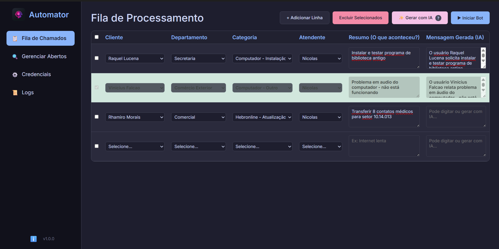
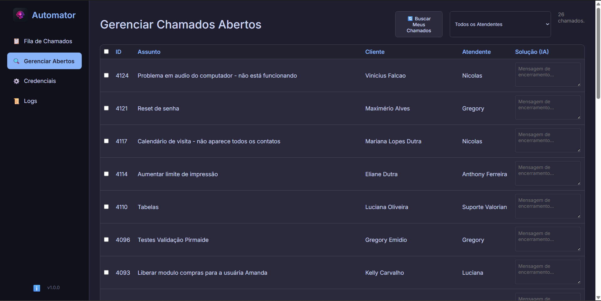
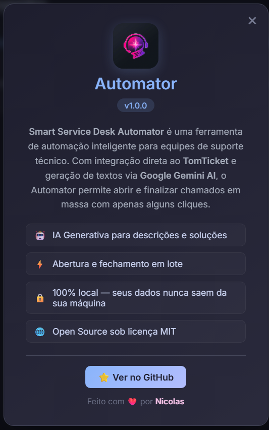

<div align="center">


# Smart Service Desk Automator

### 🤖 AI-Powered Ticket Automation · Intelligent Triage · Zero-Config Deployment

[](https://www.electronjs.org/)
[](https://ai.google.dev/)
[](https://playwright.dev/)
[](https://nodejs.org/)
[]()
[]()

[🇺🇸 English](#-english) | [🇧🇷 Português](#-português)

</div>

---

<div id="-english"></div>

## 🇺🇸 English

> **A production-ready Electron desktop application that automates the entire Service Desk lifecycle — from intelligent ticket creation with AI-generated responses to bulk resolution — built for IT teams that need to scale support without scaling headcount.**

### 📸 Screenshots & Demo

<div align="center">

#### 🖥️ Main Interface — Ticket Processing Queue


<br/>

#### 📋 Bulk Ticket Manager — Close Hundreds at Once


<br/>

#### ℹ️ About Dialog


</div>

### 🎯 The Problem It Solves

IT Support teams waste **hours daily** on repetitive ticket management: reading issues, writing standard responses, categorizing tickets, and closing resolved cases one by one. This tool eliminates that bottleneck entirely.

### 🚀 How It Works

```
📥 Tickets Arrive → 🤖 AI Reads & Understands → ✍️ Generates Professional Responses → 📤 Sends & Closes Automatically
```

The application connects directly to the **TomTicket API**, fetches open tickets, and uses **Google Gemini AI** to generate context-aware, professional responses — all with a single click from a clean desktop interface.

### ⚙️ Key Features

<table>
<tr>
<td width="50%">

**🧠 AI-Powered Intelligence**
- Integrated with **Google Gemini** (Flash & Pro models)
- Generates human-quality ticket responses in seconds
- Understands business context through customizable AI prompts
- White-label ready: each client can define their own business rules

</td>
<td width="50%">

**⚡ Bulk Automation Engine**
- Process hundreds of tickets with a single click
- Intelligent anti-spam throttling with configurable delays
- Turbo Mode for premium API accounts
- Automatic retry logic with exponential backoff (3 attempts)

</td>
</tr>
<tr>
<td width="50%">

**🔌 Dual-Mode Architecture**
- **Primary:** Direct HTTPS API integration (fast, lightweight)
- **Fallback:** Playwright browser automation (resilient, universal)
- Automatic failover ensures zero downtime
- Cross-browser support: Chromium & Firefox

</td>
<td width="50%">

**🎨 Professional Desktop UI**
- Built with Electron for native Windows/Linux experience
- Dark-friendly design with modern CSS
- Collapsible Advanced Settings panel
- Real-time log viewer with Debug Mode
- Onboarding tooltips for non-technical users

</td>
</tr>
</table>

### 🏗️ Architecture

```
┌─────────────────────────────────────────────────────┐
│                    ELECTRON APP                     │
│  ┌──────────┐  ┌──────────┐  ┌───────────────────┐  │
│  │ Renderer │──│ Preload  │──│     Main Process  │  │
│  │ (UI/CSS) │  │ (Bridge) │  │  ┌──────────────┐ │  │
│  │          │  │   IPC    │  │  │  AI Service  │ │  │
│  │ index.   │  │  Secure  │  │  │ (Gemini API) │ │  │
│  │ html     │  │ Context  │  │  ├──────────────┤ │  │
│  │          │  │ Isolated │  │  │ TomTicket API│ │  │
│  │ renderer │  │          │  │  ├──────────────┤ │  │
│  │ .js      │  │          │  │  │  Playwright  │ │  │
│  │          │  │          │  │  │  (Fallback)  │ │  │
│  └──────────┘  └──────────┘  │  └──────────────┘ │  │
│                              └───────────────────┘  │
└─────────────────────────────────────────────────────┘
         │                              │
         ▼                              ▼
   localStorage               External APIs
   (Settings &            (Google AI + TomTicket)
    Credentials)
```

### 🔒 Security by Design

> This project was built with a **security-first mindset**, following Electron and OWASP best practices.

| Practice | Implementation |
|----------|---------------|
| **Context Isolation** | `contextIsolation: true` — renderer has zero direct access to Node.js APIs |
| **Node Integration Disabled** | `nodeIntegration: false` — prevents XSS from escalating to RCE |
| **IPC Bridge (Preload)** | All main↔renderer communication goes through a secure, whitelisted `preload.js` bridge |
| **No Hardcoded Secrets** | API keys and tokens are stored locally in `localStorage`, never committed to source |
| **Local-Only Data** | Zero telemetry, zero analytics — all user data stays on the machine |
| **Input Sanitization** | AI-generated content is sanitized before being injected into the DOM |
| **LGPD/GDPR Compliant** | No PII collection, no external data transmission beyond necessary API calls |

### 🛠️ Advanced Settings

| Setting | Description | Default |
|---------|-------------|---------|
| 🧠 **AI Model** | Switch between Gemini Flash (speed) and Pro (detail) | `gemini-2.5-flash` |
| ⏱️ **Anti-Spam Delay** | Seconds between API requests to avoid rate limits | `2s` |
| 🚀 **Turbo Mode** | Disable delays for premium Google Cloud accounts | `Off` |
| 🐛 **Debug Mode** | Verbose logging of API payloads in the log viewer | `Off` |
| 🌐 **Browser Fallback** | Choose Chromium or Firefox for automation fallback | `Chromium` |

### 📦 Installation & Distribution

The application is packaged as a professional **Windows NSIS Installer** using `electron-builder`:

```bash
# Development
npm install
npm start

# Build Windows Installer (.exe)
npm run dist:win

# Build Unpacked (for testing)
npm run dist:dir
```

The installer creates desktop shortcuts, Start Menu entries, and registers in Add/Remove Programs — just like any enterprise software.

### 💻 Tech Stack

| Layer | Technology | Purpose |
|-------|-----------|---------| 
| **Frontend** | HTML5, CSS3, Vanilla JS | Lightweight, no framework overhead |
| **Desktop** | Electron 40.x | Cross-platform native experience |
| **AI Engine** | Google Gemini API | Intelligent text generation |
| **Automation** | Playwright | Browser fallback & E2E resilience |
| **API** | Node.js HTTPS (native) | Direct TomTicket integration |
| **Security** | Context Isolation, IPC Bridge | Electron security best practices |
| **Build** | electron-builder (NSIS) | Professional Windows installer |

---

<div id="-português"></div>

## 🇧🇷 Português

> **Um aplicativo Desktop Electron pronto para produção que automatiza todo o ciclo de vida do Service Desk — desde a criação inteligente de chamados com respostas geradas por IA até a resolução em massa — feito para equipes de TI que precisam escalar o suporte sem aumentar a equipe.**

### 📸 Capturas de Tela & Demo

<div align="center">

#### 🖥️ Interface Principal — Fila de Processamento


<br/>

#### 📋 Gerenciador em Massa — Feche Centenas de Uma Vez


<br/>

#### ℹ️ Modal Sobre


</div>

### 🎯 O Problema que Ele Resolve

Equipes de Suporte de TI desperdiçam **horas por dia** em tarefas repetitivas de gestão de chamados: ler problemas, escrever respostas padrão, categorizar tickets e fechar casos resolvidos um por um. Esta ferramenta elimina esse gargalo por completo.

### 🚀 Como Funciona

```
📥 Chamados Chegam → 🤖 IA Lê e Entende → ✍️ Gera Respostas Profissionais → 📤 Envia e Fecha Automaticamente
```

A aplicação se conecta diretamente à **API do TomTicket**, busca chamados abertos e utiliza a **IA Google Gemini** para gerar respostas profissionais e contextualizadas — tudo com um único clique, a partir de uma interface desktop limpa.

### ⚙️ Funcionalidades Principais

<table>
<tr>
<td width="50%">

**🧠 Inteligência Artificial Integrada**
- Integrado com **Google Gemini** (modelos Flash e Pro)
- Gera respostas com qualidade humana em segundos
- Entende o contexto do negócio através de prompts customizáveis
- White-label: cada cliente define suas próprias regras de negócio

</td>
<td width="50%">

**⚡ Motor de Automação em Massa**
- Processe centenas de chamados com um único clique
- Throttling anti-spam inteligente com delays configuráveis
- Modo Turbo para contas premium do Google Cloud
- Lógica de retry automático com backoff exponencial (3 tentativas)

</td>
</tr>
<tr>
<td width="50%">

**🔌 Arquitetura Dual-Mode**
- **Primário:** Integração direta via API HTTPS (rápido, leve)
- **Fallback:** Automação via navegador Playwright (resiliente, universal)
- Failover automático garante zero downtime
- Suporte multi-navegador: Chromium e Firefox

</td>
<td width="50%">

**🎨 Interface Desktop Profissional**
- Construído com Electron para experiência nativa Windows/Linux
- Design moderno com CSS avançado
- Painel de Configurações Avançadas retrátil
- Visualizador de logs em tempo real com Modo Debug
- Tooltips de onboarding para usuários não técnicos

</td>
</tr>
</table>

### 🏗️ Arquitetura

```
┌─────────────────────────────────────────────────────┐
│                    APLICAÇÃO ELECTRON               │
│  ┌──────────┐  ┌──────────┐  ┌───────────────────┐  │
│  │ Renderer │──│ Preload  │──│ Processo Principal│  │
│  │ (UI/CSS) │  │ (Ponte)  │  │  ┌──────────────┐ │  │
│  │          │  │   IPC    │  │  │Serviço de IA │ │  │
│  │ index.   │  │ Contexto │  │  │ (Gemini API) │ │  │
│  │ html     │  │ Isolado  │  │  ├──────────────┤ │  │
│  │          │  │ Seguro   │  │  │ API TomTicket│ │  │
│  │ renderer │  │          │  │  ├──────────────┤ │  │
│  │ .js      │  │          │  │  │  Playwright  │ │  │
│  │          │  │          │  │  │  (Fallback)  │ │  │
│  └──────────┘  └──────────┘  │  └──────────────┘ │  │
│                              └───────────────────┘  │
└─────────────────────────────────────────────────────┘
         │                              │
         ▼                              ▼
   localStorage               APIs Externas
   (Configurações          (Google IA + TomTicket)
    e Credenciais)
```

### 🔒 Segurança por Design

> Este projeto foi construído com **mentalidade security-first**, seguindo boas práticas do Electron e OWASP.

| Prática | Implementação |
|---------|---------------|
| **Context Isolation** | `contextIsolation: true` — renderer não tem acesso direto às APIs do Node.js |
| **Node Integration Desabilitado** | `nodeIntegration: false` — impede que XSS escale para RCE |
| **IPC Bridge (Preload)** | Toda comunicação main↔renderer passa por um bridge seguro e whitelistado no `preload.js` |
| **Sem Secrets Hardcoded** | Chaves de API e tokens são armazenados localmente em `localStorage`, nunca commitados |
| **Dados 100% Locais** | Zero telemetria, zero analytics — todos os dados ficam na máquina do usuário |
| **Sanitização de Input** | Conteúdo gerado por IA é sanitizado antes de ser injetado no DOM |
| **Conformidade LGPD/GDPR** | Sem coleta de PII, sem transmissão externa de dados além das chamadas de API necessárias |

### 🛠️ Configurações Avançadas

| Configuração | Descrição | Padrão |
|-------------|-----------|--------|
| 🧠 **Modelo de IA** | Alterne entre Gemini Flash (velocidade) e Pro (detalhamento) | `gemini-2.5-flash` |
| ⏱️ **Delay Anti-Spam** | Segundos entre requisições para evitar bloqueios | `2s` |
| 🚀 **Modo Turbo** | Desativa delays para contas premium do Google | `Desligado` |
| 🐛 **Modo Debug** | Log detalhado dos payloads da API no visualizador | `Desligado` |
| 🌐 **Navegador Fallback** | Escolha Chrome ou Firefox para automação | `Chromium` |

### 📦 Instalação e Distribuição

A aplicação é empacotada como um **Instalador NSIS profissional para Windows** usando `electron-builder`:

```bash
# Desenvolvimento
npm install
npm start

# Gerar Instalador Windows (.exe)
npm run dist:win

# Gerar Descompactado (para testes)
npm run dist:dir
```

O instalador cria atalhos na Área de Trabalho, entradas no Menu Iniciar e registra em Adicionar/Remover Programas — como qualquer software corporativo.

### 💻 Tecnologias

| Camada | Tecnologia | Propósito |
|--------|-----------|-----------| 
| **Frontend** | HTML5, CSS3, JS Vanilla | Leve, sem overhead de framework |
| **Desktop** | Electron 40.x | Experiência nativa multiplataforma |
| **Motor de IA** | Google Gemini API | Geração inteligente de texto |
| **Automação** | Playwright | Fallback via navegador e resiliência E2E |
| **API** | Node.js HTTPS (nativo) | Integração direta com TomTicket |
| **Segurança** | Context Isolation, IPC Bridge | Boas práticas de segurança Electron |
| **Build** | electron-builder (NSIS) | Instalador profissional para Windows |

---

<div align="center">

**Developed by Nícolas Oliveira de Araújo** · [@nicokaka](https://github.com/nicokaka)
<br>
IT Infrastructure & Cybersecurity Professional

<br>

*"Automating what humans shouldn't have to repeat."*

</div>
